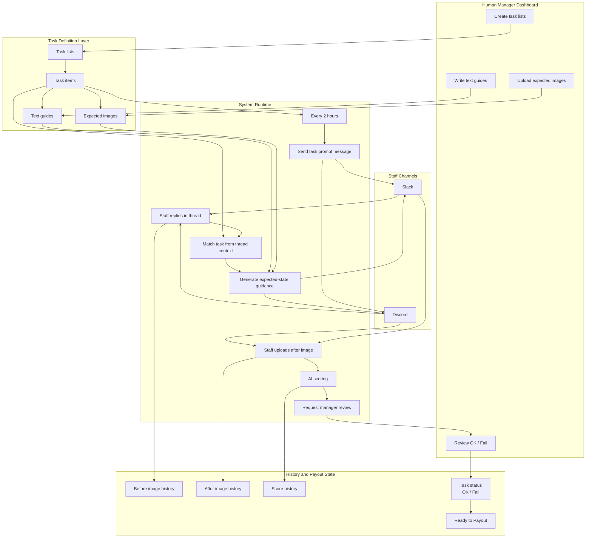

# Shelf Coach Architecture

```mermaid
flowchart TB
    subgraph Channels[Staff Channels]
        Slack[Slack]
        Discord[Discord]
    end

    subgraph Admin[Human Manager Dashboard]
        AdminTasks[Create task lists]
        AdminRefs[Upload expected images]
        AdminGuides[Write text guides]
        AdminReview[Review OK / Fail]
    end

    subgraph Knowledge[Task Definition Layer]
        TaskList[Task lists]
        TaskItems[Task items]
        Expected[Expected images]
        Guides[Text guides]
    end

    subgraph Runtime[System Runtime]
        Scheduler[Every 2 hours]
        Prompt[Send task prompt message]
        ThreadReply[Staff replies in thread]
        Match[Match task from thread context]
        GuideGen[Generate expected-state guidance]
        WorkDone[Staff uploads after image]
        Score[AI scoring]
        ReviewReq[Request manager review]
    end

    subgraph Records[History and Payout State]
        Before[Before image history]
        After[After image history]
        Scores[Score history]
        Status[Task status\nOK / Fail]
        Payout[Ready to Payout]
    end

    AdminTasks --> TaskList
    AdminRefs --> Expected
    AdminGuides --> Guides
    TaskList --> TaskItems
    TaskItems --> Expected
    TaskItems --> Guides

    TaskItems --> Scheduler
    Scheduler --> Prompt
    Prompt --> Slack
    Prompt --> Discord

    Slack --> ThreadReply
    Discord --> ThreadReply
    ThreadReply --> Match
    TaskItems --> Match
    Expected --> GuideGen
    Guides --> GuideGen
    Match --> GuideGen
    GuideGen --> Slack
    GuideGen --> Discord

    Slack --> WorkDone
    Discord --> WorkDone
    WorkDone --> Score
    Score --> ReviewReq
    ReviewReq --> AdminReview

    ThreadReply --> Before
    WorkDone --> After
    Score --> Scores
    AdminReview --> Status
    Status --> Payout
```
